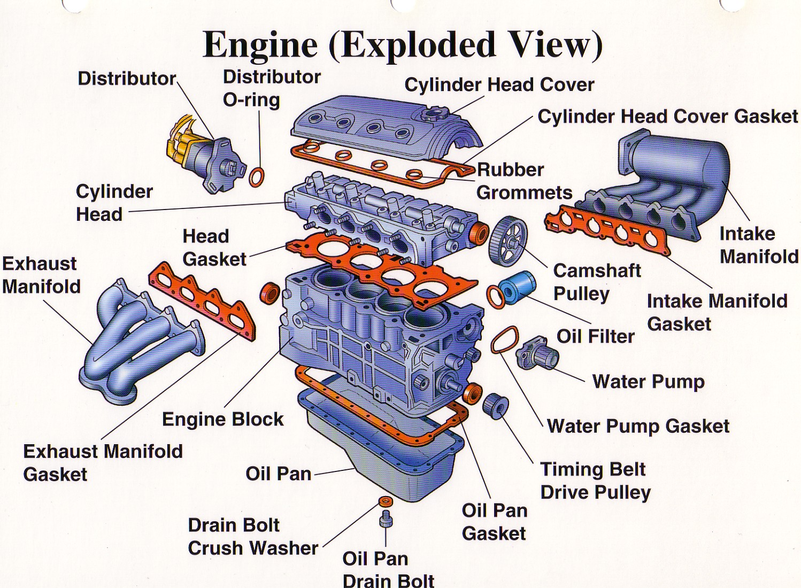
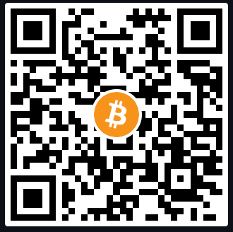
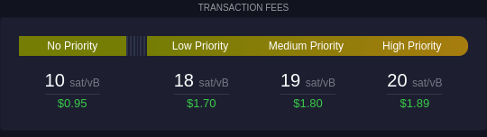
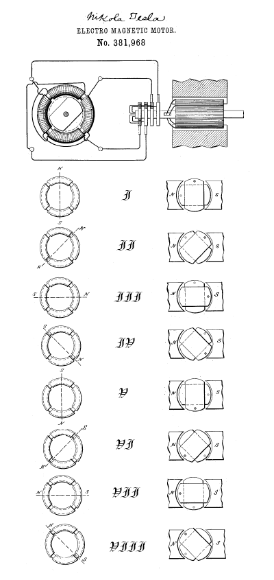

# Bitcoin 101 & Lightning 101

A way to get started with Bitcoin: or How I Learned to Stop over-complicating things and Love simplicity

---

## Overview

- Introduction
- The Punch Line
- The Car Metaphor
- What is Bitcoin
  - How to Receive Bitcoin
  - How to Send Bitcoin
  - How to Keep **Your** Bitcoin Safe
- What is the Lightning Network

---

## Introduction

- Who am I?
- Why am I doing this?
- What we **won't** talk about this presentation
- What are you looking to get out of this?
  - Who here has send & received bitcoin?
    - ...on the Lightning Network

note: My name is Jason. Online I go by Not Jason. I am here to try to provide a no bs way to look at Bitcoin for non-technical users. We are not talking about: other cryptocurrency, technical jargon, monetary theory, humanitarian / moral implication of monetary control, or the environment. If you wanted to talk about P2TR, Ludwig Von Mises, the CFA franc, the difference between LND and clightning, or how ASICS are may be leading us to sustainable energy, you are in the wrong place.

---

# The Punch Line

By learning how to send, receive, and keep your **bitcoin** secure, you can safely join the future of money with little risk.

By dollar cost averaging you remove psychological risk from investing into your long term investments.

note: If you don't have any questions after this presentation, then I have failed. This is a simple presentation that purposes removes complexity and assumes that you are here just to learn how to use BitcoinIf I haven't made a mistake, then something is also wrong. I’m here to learn how to be a more entertaining and well spoken presenter

---

# What is Bitcoin?

- Bitcoin = the network
- bitcoin = the money
- Cryptocurrency = cryptography + currency
- Open source
  - Code that is open to the public, verifiable, and under an open source license
  - https://github.com/bitcoin/bitcoin
- It's an experiment testing a new paradigm

note: Bitcoin went online in 2009 and created by a person named Satoshi Nakamoto, but really we don't care about that anymore. Bitcoin will become ubiquitous and boring. It is consider a permissionless network, where anyone can participant without consulting a centralized authority. We also don't care about that, we care about how to use it.

---

# What is a satoshi?

- $1 USD = 100 cents
- ₿1 BTC = 100,000,000 satoshis

notes: There are also finneys, bits, nano-bitcoin, and millibitcoin, but are rarely used. Satoshis can even be broken down further through some clever computer science, but not on the main Bitcoin network

---

## What is Bitcoin not

- Too difficult to use
- "Old"
- Just a trend

note: It's 15 years old. You are not late. Saying you're late today is like saying it's too late to learn how to use the Internet.

---

## The Car Metaphor

notes: When cars were first being made, no one really ask "hmm I wonder how I can save on gas".**First ask question about the how to drive. Then, ask about the engine so that you can maintain your vehicle**.

---

# How to Receive Bitcoin

What you need:

1. Wallet = where your bitcoins are secured
   - Allows you to store, receive, and send bitcoin
2. Another wallet to send you bitcoin
   - Yourself
   - Someone else

Recommendations for on-chain Bitcoin walets:

- Mobile -> https://bluewallet.io/
- Desktop -> https://electrum.org/

note: A Bitcoin Wallet is a software program that stores Bitcoin, allowing users to send, receive, and manage their Bitcoin transactions. You can send yourself bitcoin from an exchange so you can be your own bank, or receive bitcoin through someone else.

---

# What is an address / invoice

- In your wallet, you need to provide the sender a bitcoin address
- Typically done with a QR code, you can also provide the text address below it if you're not in the same room
- Example:
  - `bc1q9a9n3nyh7fnp2xyzw6favfegqt0tyy3y3q74rg`
  - 

---

# How to Send Bitcoin

1. Have a wallet with bitcoin in it
2. Scan the QR code or insert the address
3. Select the fee amount

---

# What are transaction fees

Transaction Fees at 2024-05-29 17:50 MST:

note: Transaction fees are done relative to how "in demand" the block space is. Unless you have a high transaction volume, don't worry too much about fees. If you would like to avoid fees, look into the "off chain" or "layer 2 solutions", such as the lightning network.

# How to Know Your Transaction Was Successful

- It takes on average 10 minutes
- A transaction is pending when it isn't confirmed.
- A transaction is completed when there it is confirmed.

note: 1 confirmation is good, though if it's a large/important transaction, 6 confirmation is the quick permanent solution.

---

# How to Keep Bitcoin Safe

- The first question is how much are you willing to lose?
- Would you spend $100 to protect $100?
- Your level of security depends on how much you are protecting.

note: Bitcoin is more powerful when it is in your control. The more you learn the more you can become your own bank. If it stays on exchange or someone else's computer, it has less value to you. A bird in the hand is worth two in the bush. If you understand this difference, you can reduce your risk. Or at the very least, know the risk that you are taking on when purchasing on centralized exchange, or forgetting to write down a password or backup a mobile wallet.

---

# What is a seed phrase

- If someone wanted to pretend they are you, what would they need to access your bank account?
  - A lot of your information
- Your bitcoin is protected by cryptography

![[seed-phrase-example.png]]

note: A seed phrase, also known as a recovery phrase or mnemonic seed, is a list of words which store all the information needed to recover a Bitcoin wallet. These words are formally randomly generated. Do not chose them as it would be easy to hack as human minds are not good sources of randomness.

---

# What should you do with this seed phrase?

- Keep it safe
- Keep it offline
- Have backups in it
- If it's a lot of money, increase security
  - Multisig
  - Other professional services

---

# What is the Lightning Network

An additional layer built on top of the Bitcoin network that allows for faster and cheaper transactions.

note: Now we can save on layer one fees, have quicker settlement of transaction, and have money that's easier to program than layer one Bitcoin. There are other "off-chain" or "layer 2 solutions" though lightning network is the one that is most popular

# Electric Engine

note: Just like with combustion engines, we don't really need to know how they work to use it. Your situation may be different were custody is important; which then you would learn more about your new monetary vehicle.

# ...on the Lightning Network

note: Apply the same approach to on-chain Bitcoin. Learn how to send, receive, keep it safe, but just on an additional layer

# How to Receive on the Lightning Network

# How to Send on the Lightning Network

# How to Keep your Sats Save on the Network

# Did I miss something?

Learn how to drive, then learn how to maintain your new monetary vehicle.

note: I missed a lot. Do you think there's anything I should add?

---

# Question? Continued Learning

You can see this presentation here:

- [Jameson Lopp's Resource Page](https://www.lopp.net/bitcoin-information/getting-started.html)
- [Inventing Bitcoin by Yan Pritzker](https://www.swanbitcoin.com/inventing-bitcoin/)
  - https://www.swanbitcoin.com/inventing-bitcoin/
- [Strike Learn](https://strike.me/learn/)
  - https://strike.me/learn/
- [Mastering Bitcoin Chapters 1-2](https://github.com/bitcoinbook/bitcoinbook)
- [Mempool](https://mempool.space/)
